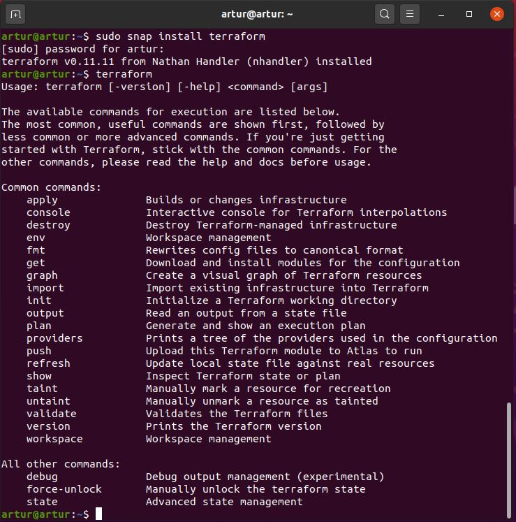

<h2>Infrastructure as Code Terraform</h2>

Terraform allows to automate and manage the infrastructure for an application or platform and services that run on that platform.

DevOps - - - - - - - - - - - - 

3 main DevOps tasks:
+ infra provisioning
+ configuring provisioned infra 
+ deploying app
+ with docker, configuration and deployment is combined togther as we have configuration in the docker image itself

Iaac:
+ provisionging and deprovisioning the cloud infrastructure
+ Pulumi - Modern Infrastructure as Code
+ automatyzacja poprzez przenoszenie kodu do innego srodowiska
+ disaster recovery (duplikowanie identycznych srodowisk)
+ zarzadzanie infrastruktura jak aplikacjami
+ przetestowanie infrastruktury
+ monitorownie stanu infrastruktury
+ przywrocanie infrastruktury do tego jako poiwnien byc pierwotnie w kodzie
+ jak robimy recznie bledy beda prawdopdobienstwo w odp dlugim czasie zmierza do 1
+ odtwarzalnosc infrastruktury - nawet jak sa roznice to jest kwestia wprowadzenia odpowiednich zmiennych do dobrze przygotowanego kodu
+ terraform zapewnia idempotentnosc - cecha metody ktora zapewnia, ze obojetnie ile razy uzyjemy tej metody, to rezultat mamy taki sam - jesli jeszcze raz uruchomimy infrastrukry, to kod za zadanie sprawdzic czy jest jako powinno byc i ewetualnie wycofac pewne zmainy do pierwotnego stanu zadanego pierwotnie przez kod

Terraform:
+ configuration file and stat file to provision infrastrucutre resources
+ implicit dependecy - we don't have to keep order of resources in the code - with explicit dependency we create resource one after another is ready and setup
+ code in .tf file - to provision and manage infrastructure 
+ hashey corp configuration language with .tf extension:
+ devlarative language - we descibe de desired aws state -  we give a blueprint on how the infrastructure should look like at the end
+ actual state in AWS matches what is being defined in the terraform code
+ terraform plan - to see what is the current status of aws
+ terraform apply --auto-approve    - deploying terraform code
+ when doploying the same code - terrafotm checks what is the current state, compers code with aws, finds what is missing in the aws then updates the missing parts
+ terraform destroy - but in order to remove from aws - we can simply remove the code from terraform file then as there is nothing in the code - terraform removes aws instances as well
+ we can reference resoueces that wasn't instantiated in the aws yet in the code - that is why we have the resource names - for terafform usage/references
+ the sequence of the code doesn't matter: we can either first put vpc and then subnet or the other way around
+ whenewer we update aws with terraform we update .tfstate fale within a project as well - this file reflecst current status in AWS - it also tracks all the dependencies between resources - it's a good practice to share this file with the team
+ we can keep variables in varaibles.tf and call them out in main.tf - if no type of variable declared then it assigns 'any'
+ output variables are good to diaplu details about provision resource on the screen
+ terraform validate - this command checks code's syntax validity
+ terraform show - showing all infrastructure that terraform sees
+ noramlly when terraform update a resource - at first it deletes resource and the creates it with an updated configuration - we can change it with declaring a lifecycle within resourc's parameters
+ we can indicate which parameters can be ingored within lifecycle by ignore_changes key word
+ other tools for provisioning infrastructre: pupper, cloud formation, ansible
+ loading resources (data resource) outside the control of terraform: data block data "local_file " fie_nem { filename = "..." } - it can be referred in resource block -> content = data.local_file.file_name.content
+ meta arguments can be used within a resource block for example for_each - creates resurces as a map - count argument creatres resources as a list
+ mitable infrastructure (changing existing resource) - immutable infrastructure (destroying old resource and creating a new one, always replace instead of changing)
+ infra provisioning: creating VPC, spin up EC2 servers, creating AWS users with permissions, installing docker
+ along with ansible for provisioning (better terraform), configuring (better ansible) and managing infrastructure
+ declarative is much better when updating infrastructure: we say what we need and it figures out how to update, in imperative we would need to explicitly instruct on rmoving resources, adding  permissions all over again
+ with declarative approach configuration file stays clean and samll but also we can see what is the current state of infrastrucutre just by looking on the config file
+ state is in json file - automatically created locally when terraform apply - should be stored in shared remote stage for the team
+ locking the stat file until an update is fully completed and unlock it for the next command for example s3 supportd stat locing and consistency checking via dynamodb
+ enabling versioning in s3 for state file - version of state changes and backup
+ using one state file per environemt - each file have his own storage backend
+ it's good to keep config file in the git repo like app code - sharing with team and keeping track of changes - testing and reviewing code
+ applying changfes with trerraform only through cd pipeline - single location from which all infrastructure changes happen - more streamlined process of updated infra
Terraform PL:
+ daje obraz infrastruktury w kodzie
+ uzywa api róznych dostawcow
+ mozna przejrzec plan dzialan
+ relizuje odtwarzalna infrastryukture
+ tworzenie systemów heterogenicznych - mozemy stowrzyc infra zlozona od roznych dostawcow
+ json - nie ma komentarzy
+ HCL - HashiCorp Configuration Language - poprawiony json - mozemy konvertowac jsona w hcl ale nie da sie w druga strone
+ sklada sie z resources, varaiables i outputs npa otuput "xxx" { value = "${aws_instance.wb.public_ip}" }
+ state plik moze tez byc zrodlem danych dla innej infrastruktury (data source)
+ zdalny stan terraforma z mechinizmem lockingu

Ansible:
+ configuration management tool
+ procedural and declerative
+ managing resources that are already created
+ execution from top to bottom like a procedural code - explicit dependency
+ no lifecycle management / no state kept in memory of a current infrastructure
+ terraform to provision and configure infrastrucutre - ansible to install and deploy applications

Installation and executing:
1. Dwonloading  terraform.exe and pasting to C drive
2. Adding Path to system variables
3. create new project
4. create main.tf
5. terraform init
6. terraform plan
7. terraform apply

<code>
 resource "local_file" "pet" {
    filename = "./test.txt"
    content = "test content"
}
 </code>

<h3>Terraform architecture</h3>
<ul>
  <li>2 input sources:
     
    - TF-config: defininig what needs to be creatred or provisioned.  
    - State: tracks up-to-date state of current infrastructure setup.
  </li>
   
  <li>Both inputs goes to CORE
     
    - it figures out the plan of what actions are necessary to achieve desired state  
    - compares current state agains the desired one degined in config file
  </li>
   
  <li>Providers for a specific technology participate in plan execution:
     
    - IaaS  - Infrastructre as a Service   - AWS / Azure  
    - PasS  - Platform as a Service        - Kubernetes  
    - SaaS  - Software as a Service        - Fastly  
    - providers can build up the infrastructure on different levels, f.e.: AWS, Kubernetes on top and Service inside cluster  
    - providers gives thei resources: having AWS as the provider you get access to f.e. EC2 instances, AWS USers etc.
  </li>
</ul>

<h3>Configuration file</h3>
<ul>
  <li>Defining provider, resource and its attributes.</li>
  <li>When updating infrastructure, only thing is to adjust current config file and re-execute it.</li>
  <li>It alwyas reflects the current setup of infrastructure.</li>
</ul>

<h3>Terraform commands</h3>
<ul>
  <li>refresh - querys infrastructure provider to get current state</li>
  <li>plan - creates an execution plan</li>
  <li>apply - executes plan
     
    - checks what is currently running and creates the plan of what needs to be updated/created
  </li>
  <li>destroy - destorys infrastructure 
     
    - checks what is currently running and creates the plan of what needs to be removed in which order
  </li>
</ul>

<h3>Terraform installation</h3>
<ul>
  
</ul>

